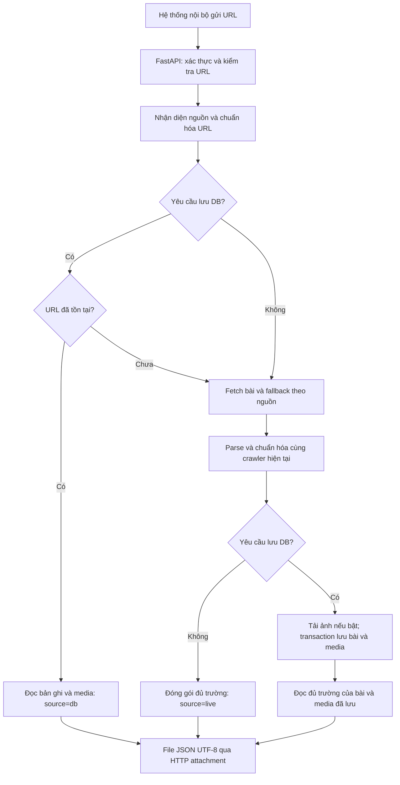

# Phương án API crawl bài báo theo URL

Ngày khảo sát và cập nhật yêu cầu: 2026-09-23. Đây là phương án triển khai; API chưa được xây dựng.

## 1. Phạm vi và quyết định đề xuất

- “Real time” được hiểu là gọi API với một URL bài báo và nhận một file JSON UTF-8 trong cùng HTTP response.
- Bản đầu hỗ trợ các nguồn có trong cấu hình hiện tại. URL trang chủ, trang chuyên mục và nguồn chưa hỗ trợ trả lỗi rõ ràng.
- File chứa đầy đủ các cột của ba bảng `articles`, `article_images`, `article_videos`, gồm ID, khóa ngoại và timestamp. Bên nhận quyết định nơi lưu và cách nhập dữ liệu.
- Mặc định `save_to_db=false`: lấy nội dung mới từ nguồn, tạo file JSON và trả về; đường xử lý này không đọc/ghi DB và không cần `DATABASE_URL`.
- `save_to_db=true`: ghi thêm vào PostgreSQL đang dùng rồi vẫn trả file JSON cùng schema. URL đã tồn tại trả bản ghi hiện tại trong file, cùng trạng thái `existing`, tương ứng hành vi bỏ qua bài trùng của cron. Chế độ này không hứa trả phiên bản mới nhất của bài cũ.
- Cờ `save_to_db` chỉ điều khiển việc lưu DB, không điều khiển việc trả file. API tạo nội dung file trong bộ nhớ; không cần lưu JSON lâu dài trên server.
- `download_images=false` mặc định: trả URL ảnh. `download_images=true` yêu cầu `save_to_db=true`, tải ảnh cho bài mới theo quy ước hiện tại.
- Tách tiến trình API trong `craw_real_times`, dùng chung mã crawler qua import Python. Chạy từ thư mục gốc hoặc đóng gói cả hai package vào cùng Docker image.
- Bản đầu dùng FastAPI và một tiến trình Uvicorn với giới hạn crawl đồng thời. Tăng số tiến trình/replica sau khi bổ sung giới hạn theo domain dùng chung.

## 2. Căn cứ từ mã nguồn hiện tại

| Thành phần | Hiện trạng | Cách sử dụng |
|---|---|---|
| `crawl_lastest_news/main.py:110` | Tạo `NewsSiteCrawler`, gọi `crawl()` theo site | Giữ entry point cron; API có entry point riêng |
| `crawl_lastest_news/site_crawler.py:808` | Discover chuyên mục → discover URL → fetch → fallback MOHA/MOF → parse → save | Tách phần xử lý một URL thành hàm công khai dùng chung |
| `crawl_lastest_news/site_crawler.py:1769` | `_parse_article()` nhận `CategoryInfo`; một số nguồn dựa vào category của trang danh sách | Thêm cách giải quyết category trực tiếp từ trang bài |
| `crawl_lastest_news/site_crawler.py:1949` | `_save_article()` trả bool, bỏ qua URL đã có; tải ảnh ngoài transaction | Thêm kết quả lưu có dữ liệu bài viết; giữ wrapper bool cho cron |
| `crawl_lastest_news/crawler/article.py:91` | `ArticleExtractor` và cấu hình selector riêng từng nguồn | Tái sử dụng cùng các quy tắc hậu xử lý của `NewsSiteCrawler` |
| `crawl_lastest_news/config/__init__.py` | Registry `SiteConfig` | Xây bộ nhận diện nguồn theo hostname |
| `crawl_lastest_news/db/models.py:43` | UUIDv5 từ đúng URL lưu DB, namespace lấy từ môi trường | Dùng cùng namespace và quy tắc URL; với bài cũ lấy ID từ DB |
| `crawl_lastest_news/db/models.py:57` | `articles`, `article_images`, `article_videos` | Giữ schema hiện tại trong bản đầu |

Lưu ý tương thích: `tags` ở DB là chuỗi phân cách bằng dấu phẩy; ảnh/video có `sequence_number`; video hiện giới hạn tối đa 5 khi lưu. Luồng cron này lưu `comments=None`; không tự thêm `author` hay `content_html` vào hợp đồng bản đầu chỉ vì extractor có các trường đó.

## 3. Luồng xử lý



Hàm công khai dự kiến: `NewsSiteCrawler.fetch_article(url, *, category=None, policy=None) -> ParsedArticle`. Hàm này bao gồm fetch, fallback MOH/MOHA/MOF và parse; không discover danh sách, không tự ghi DB. `crawl()` truyền category sẵn có để giữ hành vi cron.

Khi API chỉ nhận URL, ưu tiên category cố định trong cấu hình, metadata/selector của nguồn, breadcrumb và JSON-LD. Không suy diễn chuyên mục từ slug tiêu đề. Nếu đã xác định được đây là bài báo nhưng thiếu category, chế độ API trả `null` cùng cảnh báo `CATEGORY_MISSING`; chế độ cron giữ quy tắc hiện tại. Trang danh sách hoặc trang lỗi không được vượt qua kiểm tra bài viết chỉ vì cho phép category rỗng.

## 4. Hợp đồng API

`POST /internal/v1/articles/crawl`

Request headers: `Content-Type: application/json`, `X-API-Key: <internal-key>`.

```json
{
  "url": "https://vnexpress.net/duong-dan-bai-bao.html",
  "save_to_db": false,
  "download_images": false
}
```

Chỉ `url` bắt buộc. Bỏ qua `save_to_db` tương đương `false`. URL trên là ví dụ định dạng, không phải URL dùng kiểm thử trực tiếp.

Response thành công là nội dung file, không phải đường dẫn file trên server hay chuỗi JSON được bọc thêm một lớp:

```http
HTTP/1.1 200 OK
Content-Type: application/json
Content-Disposition: attachment; filename="article_<article_id>.json"
Cache-Control: no-store
```

Tên file thực tế thay `<article_id>` bằng UUID của bài. Body mã hóa UTF-8, giữ nguyên tiếng Việt. Hai chế độ dùng cùng tên trường và schema; chỉ khác kết quả lưu và dữ liệu được chọn theo chính sách bài trùng.

Ví dụ nội dung file đủ trường của ba bảng; URL/UUID/nội dung dưới đây là dữ liệu minh họa, không phải kết quả crawl thật. File mẫu tương ứng: `examples/article_export.example.json`.

```json
{
  "schema_version": "1.0",
  "request_id": "7d974210-1e47-4c61-8f25-05602ae45bd6",
  "status": "success",
  "source": "live",
  "persistence_status": "not_requested",
  "exported_at": "2026-09-23T03:00:00Z",
  "generated_timestamp_timezone": "Asia/Ho_Chi_Minh",
  "duration_ms": 1800,
  "data": {
    "articles": [
      {
        "id": "6639460f-3425-5329-8097-a58f06127860",
        "title": "Tiêu đề bài báo",
        "description": "Nội dung sapo",
        "content": "Nội dung bài báo",
        "category_id": "thoi-su",
        "category_name": "Thời sự",
        "comments": null,
        "tags": "tag1,tag2",
        "url": "https://vnexpress.net/duong-dan-bai-bao.html",
        "publish_date": "2026-09-23T09:00:00",
        "created_at": "2026-09-23T10:00:00",
        "updated_at": "2026-09-23T10:00:00",
        "article_name": "vnexpress"
      }
    ],
    "article_images": [
      {
        "id": "019974ae-b780-7000-8000-000000000001",
        "article_id": "6639460f-3425-5329-8097-a58f06127860",
        "image_path": "https://cdn.example.com/image.jpg",
        "status": "pending",
        "sequence_number": 1,
        "created_at": "2026-09-23T10:00:00"
      }
    ],
    "article_videos": [
      {
        "id": "019974ae-b780-7000-8000-000000000002",
        "article_id": "6639460f-3425-5329-8097-a58f06127860",
        "video_path": "https://cdn.example.com/video.mp4",
        "sequence_number": 1,
        "created_at": "2026-09-23T10:00:00"
      }
    ]
  },
  "warnings": []
}
```

- `persistence_status`: `not_requested`, `created`, `existing`.
- `source=live`: vừa fetch; `source=db`: trả bài đã có, gồm trường hợp một request khác/cron thắng cuộc đua insert.
- `data.articles` có đúng một phần tử; `data.article_images` và `data.article_videos` là mảng, rỗng nếu không có media. Mỗi object chỉ chứa các cột thực của bảng tương ứng; metadata của file nằm ngoài `data`.
- Các trường nullable vẫn xuất hiện với giá trị `null` khi không trích được, không tự tạo thông tin nguồn không có. Các cột `NOT NULL`, gồm ID, khóa ngoại và timestamp, phải có giá trị hợp lệ.
- Ở chế độ không lưu, tạo `articles.id` bằng UUIDv5 theo URL/namespace hiện có; tạo ID ảnh/video bằng UUIDv7 theo quy ước model, gán mọi `article_id` đúng ID bài. Các ID này dùng được để lưu về sau nhưng không khẳng định bản ghi đã tồn tại trong DB.
- Tạo `created_at` và `updated_at` từ cùng thời điểm đóng gói khi chưa có bản ghi DB. Đây là timestamp đề xuất cho lần nhập mới, không phải thời gian xuất bản. Cấu hình `RECORD_TIMEZONE` mặc định `Asia/Ho_Chi_Minh` cho timestamp sinh mới, xuất dạng ISO 8601 không offset phù hợp cột `DateTime` hiện tại; ghi rõ timezone này ở `generated_timestamp_timezone`. `exported_at` luôn là thời điểm UTC có `Z`.
- Khi `save_to_db=true`, bản ghi mới phải lưu đúng ID/timestamp đã chuẩn bị; file cuối cùng chứa giá trị thực sau commit. Với bài trùng, lấy ID/timestamp và media của bản ghi đã tồn tại. Không sinh lại ID media khi serialize dữ liệu đã lưu.
- `publish_date` có thể null. Giữ ý nghĩa datetime hiện có, không tự gắn hậu tố `Z` cho giá trị thiếu timezone. Việc chuẩn hóa timezone toàn kho là thay đổi riêng.
- ID media sinh một lần cho mỗi bản xuất chưa lưu; một lần crawl khác có thể sinh ID media khác. File không quyết định chính sách upsert của bên nhận. Với ID legacy trong DB khác UUIDv5 hiện tại, bên nhận cần tự quyết định cách đối chiếu URL; chế độ không lưu không truy vấn DB để đoán ID cũ.
- Dùng chung serializer/normalizer với persistence cho độ dài trường, tags, thứ tự media và giới hạn video. URL dài hơn giới hạn cột bị từ chối thay vì cắt cụt để tạo ID.
- `200` kèm file cho cả created/existing/không lưu; không nhầm bài trùng với lỗi crawl. Nếu yêu cầu lưu DB nhưng lưu thất bại, trả lỗi non-2xx, không trả thành công giả với `created`.
- API phụ: `GET /health/live`, `GET /health/ready`, `GET /internal/v1/sites`; endpoint nội bộ và tài liệu OpenAPI cần xác thực hoặc được gateway bảo vệ.

| HTTP | Mã ứng dụng | Ý nghĩa |
|---|---|---|
| 401 | `UNAUTHORIZED` | Thiếu/sai API key |
| 422 | `INVALID_URL`, `UNSUPPORTED_SITE`, `INVALID_OPTIONS` | Đầu vào không hợp lệ |
| 422 | `NOT_AN_ARTICLE` | Trang danh sách/trang không có nội dung bài hợp lệ |
| 404 | `ARTICLE_NOT_FOUND` | Nguồn trả 404/410 hoặc trang lỗi tương đương |
| 429 | `RATE_LIMITED` | Vượt giới hạn gọi hoặc giới hạn nguồn |
| 502 | `UPSTREAM_ERROR` | Nguồn bị chặn hoặc lỗi fetch/parse bất thường |
| 503 | `BUSY`, `DB_UNAVAILABLE` | Hết slot crawl hoặc DB lỗi trong chế độ lưu |
| 504 | `CRAWL_TIMEOUT` | Hết ngân sách chờ |

Lỗi dùng JSON thông thường với envelope thống nhất: `request_id`, `status=error`, `error={code,message,retryable}`, không đặt `Content-Disposition: attachment`. Không trả stack trace hoặc thông tin kết nối DB.

Ánh xạ cho bên nhận file:

| Phần dữ liệu | Bảng đích | Các cột đầy đủ |
|---|---|---|
| `data.articles` | `articles` | `id`, `title`, `description`, `content`, `category_id`, `category_name`, `comments`, `tags`, `url`, `publish_date`, `created_at`, `updated_at`, `article_name` |
| `data.article_images` | `article_images` | `id`, `article_id`, `image_path`, `status`, `sequence_number`, `created_at` |
| `data.article_videos` | `article_videos` | `id`, `article_id`, `video_path`, `sequence_number`, `created_at` |

Bên nhận chỉ cần ánh xạ ba nhóm dữ liệu trên vào bảng tương ứng, parse UUID/datetime theo driver của mình và quyết định cơ chế lưu. Việc xây công cụ nhập dữ liệu cho hệ thống khác nằm ngoài phạm vi service này.

## 5. URL, concurrency, timeout và dữ liệu

**Nhận diện và bảo vệ URL:** dùng hostname chính xác và alias đã khai báo, ưu tiên host cụ thể nhất; không dùng chuỗi chứa tên báo hoặc suffix quá rộng như `.vn` để cấp quyền fetch. Chỉ HTTP/HTTPS, cấm userinfo/port không được phép, kiểm tra địa chỉ IPv4/IPv6 đích. Tắt redirect tự động, kiểm tra lại mỗi bước redirect và giới hạn số bước. Áp dụng cùng chính sách cho fallback API và URL ảnh/CDN. Kết hợp chặn mạng đích nội bộ ở lớp egress của crawler, có ngoại lệ cấu hình riêng cho DB. Đây là biện pháp trực tiếp cho API nhận URL, theo [hướng dẫn SSRF của OWASP](https://cheatsheetseries.owasp.org/cheatsheets/Server_Side_Request_Forgery_Prevention_Cheat_Sheet.html).

**Chuẩn hóa:** giữ quy tắc query theo `SiteConfig.keep_query_params`, fragment/default port theo mã hiện có. Không tự đổi HTTP thành HTTPS, www hoặc canonical URL nếu việc đó làm khác khóa mà cron đang lưu. ID sinh từ đúng URL cuối cùng dùng để lưu. Namespace phải giống cron; startup kiểm tra cấu hình này ngay cả khi không ghi DB.

**Thực thi:** HTTP crawler hiện dùng `requests` và SQLAlchemy đồng bộ. Chạy công việc này trong executor có giới hạn; route async chỉ điều phối và chờ, không gọi blocking I/O trực tiếp. FastAPI cũng hỗ trợ route `def` qua threadpool; xem [tài liệu concurrency](https://fastapi.tiangolo.com/async/). Tạo crawler/HTTP session cho từng tác vụ; SQLAlchemy session cho mỗi transaction, không chia sẻ session giữa thread.

**Cấu hình thử nghiệm ban đầu:** 1 tiến trình API, 8 tác vụ crawl tối đa, 1 request HTTP đang chạy/domain và khoảng cách tối thiểu 0,5 giây hoặc cao hơn theo cấu hình site. Hết slot trả `503 BUSY`; không để hàng chờ RAM tăng vô hạn. Giới hạn theo domain đặt ở service để có hiệu lực giữa nhiều request, không chỉ ở từng crawler instance. Cron là tiến trình khác: cần chia ngân sách truy cập hoặc dùng limiter chung trước khi tăng tải.

**Timeout:** đề xuất connect 3 giây, read 10 giây, tối đa 1 retry lỗi tạm thời, ngân sách chờ API 30 giây, gateway 35 giây. Mọi retry, backoff, fallback, download ảnh phải kiểm tra deadline chung; giới hạn kích thước HTML/ảnh và đọc body có kiểm tra thời gian. Các số này là cấu hình khởi đầu, cần đo trước khi cam kết SLA. `requests.timeout` không phải timeout tổng cho tải response; xem [tài liệu Requests](https://requests.readthedocs.io/en/latest/user/quickstart/#timeouts).

Response timeout không tự dừng thread đang blocking. Khi client hết hạn, đánh dấu tác vụ hủy, bỏ các bước tiếp theo và giữ slot đến khi thread thực sự kết thúc. Nếu cần bảo đảm dừng cứng toàn bộ tác vụ thì bổ sung worker process có thể kết thúc; không coi timeout của coroutine là giải pháp đó. Timeout trong lúc commit có thể có kết quả chưa xác định với caller; retry cùng URL và đọc DB để xác nhận, không hứa rằng 504 đồng nghĩa rollback.

**Lưu DB:** chức năng phụ, chỉ gọi khi `save_to_db=true`. Chế độ chỉ xuất file không khởi tạo engine/session, không kiểm tra bài trùng trong DB và vẫn hoạt động khi DB lỗi hoặc chưa cấu hình. Khởi tạo engine/session factory một lần, an toàn giữa các thread, khi phát sinh yêu cầu lưu đầu tiên. Readiness của chức năng xuất file không phụ thuộc DB. Giữ transaction ngắn, tải mạng ngoài transaction. Unique constraint URL/ID là lớp bảo vệ cuối cùng khi cron và API cùng xử lý; chỉ chuyển lỗi unique tương ứng thành `existing`, rollback rồi đọc lại bản ghi. Các lỗi integrity khác phải báo lỗi. Serializer nhận dữ liệu đã tải đầy đủ quan hệ trước khi đóng session.

**File JSON:** dùng một hàm đóng gói chung cho cả hai chế độ. Sinh bytes UTF-8 trong bộ nhớ và trả attachment; không tạo đường dẫn lưu tùy ý hoặc lưu file JSON trên disk trong luồng mặc định. Kiểm tra đủ cột, kiểu dữ liệu, ràng buộc `NOT NULL` và liên kết article/media trước khi trả. Version schema giúp bên nhận xử lý thay đổi hợp đồng sau này.

**Ảnh:** dùng quy ước thư mục/ngày và tên file theo article ID hiện có; API không nhận đường dẫn thư mục tùy ý. Tải bằng file tạm riêng rồi chuyển atomically sang file đích. Ảnh lỗi giữ URL nguồn và `status=failed`, trả cảnh báo; không đánh mất bài đã parse hợp lệ. `image_path` local là đường dẫn trên server, không tự biến thành URL có thể tải từ máy caller; nếu cần truy cập file thì bổ sung media service/object storage sau.

Lưu bài với `download_images=false` sẽ tạo ảnh `pending`; cron hiện bỏ qua bài đã tồn tại nên sẽ không tự tải các ảnh này. Trường hợp cần ảnh local ngay phải gọi `save_to_db=true, download_images=true` cho bài mới; với bài cũ dùng quy trình redownload hiện có hoặc endpoint chuyên biệt ở giai đoạn tiếp theo. `download_images=true` trên bài đã có không tự thay ảnh và phải trả cảnh báo rõ ràng.

## 6. Cấu trúc dự kiến

```text
craw_real_times/
  __init__.py
  app.py                     # FastAPI, lifespan và routes nhỏ
  schemas.py                 # Request, response và mã lỗi
  settings.py                # Key, timeout, concurrency, DB capability
  service.py                 # Điều phối một URL
  site_resolver.py            # URL -> SiteConfig
  security.py                # API key, URL và redirect policy
  http_client.py             # Client API có deadline và giới hạn body
  runtime.py                 # Executor, admission và domain limiter
  serializers.py             # Đủ cột ba bảng, ID/FK/timestamp và bytes JSON
  examples/
    article_export.example.json  # File mẫu đủ trường cho bên tích hợp
  tests/
  requirements.txt           # Dùng requirements crawler + dependency API đã pin
  Dockerfile
  compose.yml
  README.md
crawl_lastest_news/
  site_crawler.py             # Entry point một bài dùng chung
  article_repository.py      # Kết quả lưu/đọc; wrapper bool cho cron
```

Giữ parser, selector và cấu hình site ở `crawl_lastest_news`; API không có bản sao riêng. Khai báo rõ phiên bản Python/dependency được kiểm tra khi triển khai, không mặc định rằng requirements chưa pin hiện tại đã tái lập được môi trường.

## 7. Thứ tự triển khai và tiêu chí kiểm tra

| Bước | Phạm vi và file dự kiến (tối đa khoảng 5 file/bước) | Điều kiện hoàn thành | Kiểm tra |
|---|---|---|---|
| 1 | `site_crawler.py`, test single-article, fixture HTML | Hàm fetch một URL chạy đủ fallback; cron giữ category policy cũ; API nhận diện được bài thiếu category | Unit test với HTML cố định, bảo đảm không gọi discover |
| 2 | `site_resolver.py`, `security.py`, `http_client.py`, test URL/client | Nhận diện đúng nguồn, bảo vệ mọi đích fetch, giữ query cần thiết | Test host giả, IPv4/IPv6 riêng, redirect/CDN, giới hạn byte và timeout |
| 3 | `schemas.py`, `serializers.py`, `service.py`, test contract, file JSON mẫu | URL → file JSON không cần DB; đủ mọi cột ba bảng kể cả ID/FK/timestamp | Đối chiếu keys với model; kiểm tra NOT NULL, UUID, quan hệ media, Unicode và DB không được gọi |
| 4 | `article_repository.py`, wrapper trong `site_crawler.py`, service, test PostgreSQL | Chỉ lưu khi cờ true; file phản ánh đúng bản ghi sau commit hoặc existing | Integration test trên DB test riêng: so sánh file với DB, unique URL/ID, rollback và race |
| 5 | `runtime.py`, `settings.py`, `app.py`, test API/runtime | Route + auth + file attachment và lỗi thống nhất; giới hạn task/domain; timeout không làm thất thoát slot | Kiểm tra Content-Type/Disposition, tải và đọc lại file; mock nguồn chậm, hết slot và API key sai |
| 6 | Service download, `http_client.py`, serializer, test media | Ảnh local đúng đường dẫn/trạng thái; lỗi một ảnh không làm mất bài; existing không bị sửa ngầm | Test ảnh lỗi/quá lớn, timeout, file tạm và thứ tự media |
| 7 | `requirements.txt`, `Dockerfile`, `compose.yml`, `README.md`, file kiểm thử smoke/load | Container chạy riêng, truy cập qua private gateway, logging và hướng dẫn gọi đầy đủ | Chạy toàn bộ regression, smoke các nguồn đại diện, đo tải trong staging |

Checkpoint sau bước 3: URL → file JSON đủ trường chạy end-to-end với HTTP giả lập và DB không cấu hình, regression crawler cũ pass. Sau bước 5: cả hai chế độ trả file cùng schema, lưu chỉ khi cờ true, API/concurrency pass. Sau bước 7: smoke trên các nguồn đại diện như VNExpress, Tuổi Trẻ, VOV và nhóm có fallback MOHA/MOF; ghi rõ nguồn nào thực sự đã kiểm thử.

Lệnh dự kiến sau khi các file được tạo, chạy từ `D:\crawl_bao`:

```powershell
python -m pip install -r craw_real_times/requirements.txt
python -m unittest discover -s crawl_lastest_news/tests -v
python -m unittest discover -s craw_real_times/tests -v
python -m uvicorn craw_real_times.app:app --host 127.0.0.1 --port 8000 --workers 1
docker compose -f craw_real_times/compose.yml up -d --build
```

Integration test ghi DB phải trỏ tới database test riêng; không dùng DB vận hành. Benchmark tách số liệu crawl mới/đọc DB và có/không tải ảnh. Mục tiêu khởi đầu cho crawl mới không tải ảnh: p95 dưới 10 giây trên bộ nguồn kiểm thử khỏe; đây là mục tiêu nghiệm thu sau đo, chưa phải kết quả khảo sát.

## 8. Đưa vào vận hành

- Docker build context là thư mục gốc để chứa cả hai package. Container API tách khỏi cron; dùng cùng namespace UUID và cấu hình DB khi bật lưu.
- Publish qua hostname/gateway nội bộ, TLS và `X-API-Key`; bind port host vào loopback khi reverse proxy cùng máy hoặc IP private khi có firewall phù hợp.
- Mount thư mục ảnh dùng chung nếu cần ảnh local. Secret lấy từ environment/secret store, không đưa vào image hoặc README.
- Log có `request_id`, site, trạng thái, thời gian fetch/parse/save, kết quả DB và cảnh báo ảnh; bỏ API key và query nhạy cảm khỏi log.
- Theo dõi p50/p95, tỉ lệ lỗi theo nguồn, timeout, số slot đang dùng và số lần DB trùng. Theo dõi trạng thái DB riêng; DB lỗi không làm readiness của luồng xuất file thất bại.
- Rollback bằng dừng container API; cron vẫn dùng entry point hiện tại. Những refactor dùng chung phải qua regression trước khi phát hành.
- Ước lượng sơ bộ: 3–5 ngày công cho một lập trình viên quen dự án, gồm test và staging; có thể tăng nếu nhiều nguồn không trích được category từ URL đơn lẻ. Đây không phải cam kết tiến độ đã benchmark.

Giai đoạn tiếp theo chỉ mở khi có nhu cầu: cập nhật nội dung bài đã có (`refresh` với chính sách media rõ ràng), batch URL, hàng đợi bền vững và API job nếu tác vụ dài, hoặc trả URL media nội bộ. Không đưa các chế độ chưa triển khai vào request schema bản đầu.
